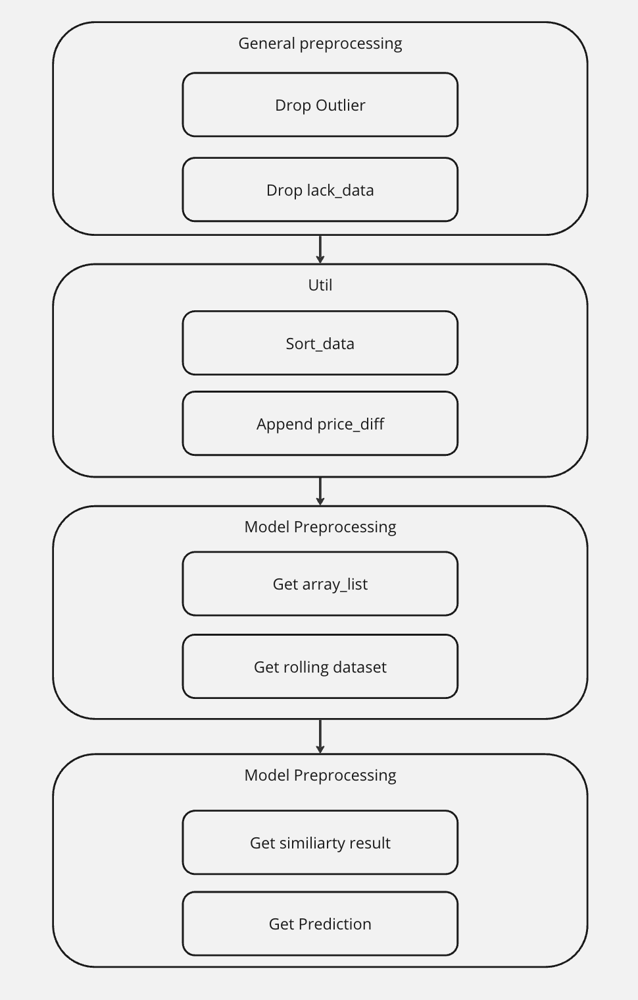

# 제2회 KRX 주식투자 알고리즘 경진대회

## 예선

### 구현 사항
1. 1달간 long position을 가져갈 Ticker 구하기
2. 1달간 short position을 가져갈 Ticker 구하기



### Theme

    similarity 기반의 Model
    Factor는 price_diff
    parameter = {
        dataset_window,
        input_window,
        output_window
    }

## 본선

```
.
├── __init__.py
├── loader
│   ├── __init__.py
│   ├── api_loader.py : [Data From api]
│   └── static_loader.py : [Data From Local (Static dataa)]
├── processor
│   ├── __init__.py
│   ├── data
│   │   └── symbol_sector_dict.py [Static Data dict]
│   ├── model_processor.py [Fundamental / Technical Models]
│   ├── order_processor.py [Buying_order / Selling_order]
│   └── sector_processor.py [Sector grouping for fundamental / technical models]
└── trade_func.py [signiture]
```

Initial_parameter

    초기 투자금 : 10억

### 구현 사항
1. 구매할 종목을 선정하는 알고리즘
    - 구매할 종목을 선정했을때, 얼마나 구매할 것인지에 대해 선정하는 알고리즘

2. 판매할 종목을 선정하는 알고리즘
    - 판매할 종목을 선정했을때, 얼마나 판매할 것인지에 대해 선정하는 알고리즘

### 특이 사항
    - 주식의 매수시 0.1 % 증권사 수수료 부과
    - 주식의 매도시 0.1 % 증권사 수수료 부과 
    - 주식의 매도시 0.2 % 증권사 수수료 부과

### Themes
기본적 분석, 기술적 분석을 둘다 사용하는것이 좋은 경험일 것 같다.

- Fundamental Analysis  
    - PBR
    - PER
    - ROE
    - EV/EBITDA

- Technical Analysis
    - Similarity (pair trading)

### ISSUE
3500 가량의 주식을 매 투자마자 전수조사 하는것이 30분 코드 러닝타임에 위협적이다.

    -> PBR score std를 보았을 때, 오차구간 5% 에서 신뢰구간 90~95%를 보여주는 250개 가량의 sampling을 진행하기로 한다. (0)

fundamental data 가 존재하지 않는 symbols 많이 존재

    -> fundamental data ETL을 통해 symbols filtering을 진행하고 투자를 진행하면 될것 같다. (0)

Backtesting 진행을 위해서 loader class 수정이 필요할것 같다.

    -> API 명세를 볼때, 백테스팅을 위해선 비효율적 Loader class를 하나 만들어야 할 수도 있다. (0)

ROE, EV/EBITDA, Similarity 세 가지 분석이 모든 백테스팅에서 음수값의 결과를 가져 왔다.

    -> 많은 모델을 썻다고 자랑하는 대회는 아니니, 배제하기로 한다. (0)

기본적 분석을 통한 투자는 투자기간이 길어질수록 수익률이 높아질 확률이 높다.

    -> n일의 투자금액을 (현재 cash*0.75) 투자하는 것으로 하여 큰 투자는 투자기간이 길어지도록 유도한다. (0)


### Learned
    첫 장기 프로젝트 이후 나름 두번째 장기 프로젝트 였다.
    첫 장기 프로젝트에서 원했던 pipeline based project로 잘 마무리한것 같다.
    프로젝트 설계에 대한 고민에 관련해 매력적인 해답지를 찾아낸것 같다.
    통계학과에서 배웠던 샘플링 아이디어와 신뢰구간 기반의 적절한 샘플링 수 선정을 실무에 활용한 좋은 경험이었다.
